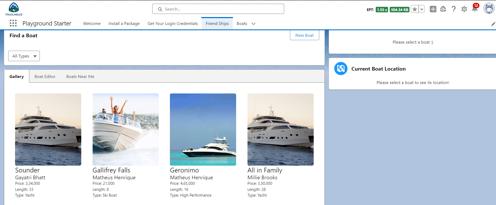
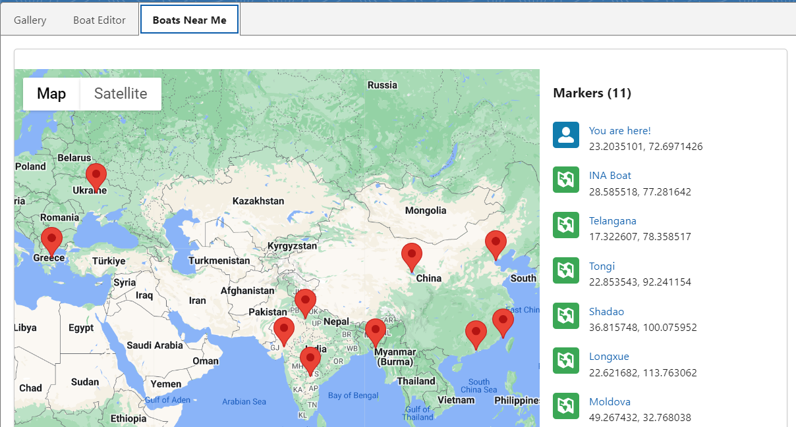
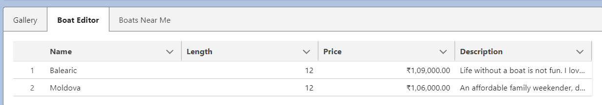
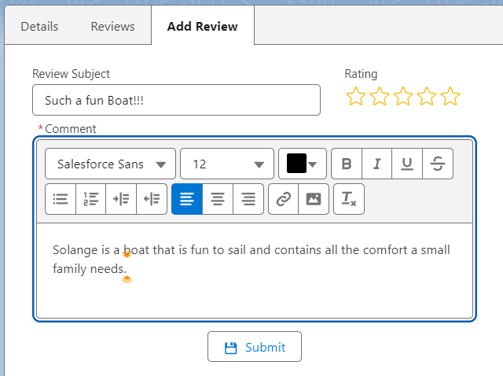
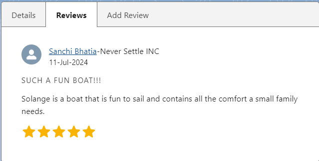

# Use Case
Over the past few years, HowWeRoll Rentals, the world’s largest recreational vehicle (RV) rental company, has dominated the RV rental marketplace. Its tagline is “We have great service because that’s How We Roll!” Its rental fleet includes every style of camper vehicle, from palatial mobile homes to old-school, chrome Airstream campers. If you’re plagued with wanderlust, HowWeRoll has the cure!

As the lead Salesforce developer for HowWeRoll, you’ve been instrumental in making the company a huge success. In order to continue revenue growth, the company’s leadership has decided to expand beyond its core RV market and enter the recreational boating industry, as surveys have shown that a large share of RV travelers are also boat owners. Instead of investing in boats of its own, HowWeRoll plans to start a boat-sharing program where the company acts as a leasing agent for its customers’ boats. HowWeRoll is calling this new service Friend Ships.

Tatiana Loyal is the stellar Salesforce developer at HowWeRoll. She’s started an implementation of a custom Lightning interface, surfaced in Lightning Experience, but she’s now out on maternity leave. You’ve been asked to continue her work developing a Lightning application that enables sales associates to enter information about their customers’ boats, including boat’s locations. You’ve also been asked to enable your team members to post comments and ratings about their experiences when they inspect each boat.

Rather than start over, you begin with some code written by Tatiana. As you know—good programmers write good code; great programmers reuse good code.

First you develop a custom search engine so HowWeRoll’s sales associates can dynamically filter the boats based on boat type (such as a fishing boat, pleasure boat, party boat) in order to match customer requests with the boating inventory.

Then you create a map that displays up to 10 boats based on the current user’s location.

Finally, you convert an existing, outdated Visualforce page that shows boats similar to the search query into a reusable solution with Lightning Web Components.

# Standard Objects
1. **Contact** - Organization contacts and boat owners.
2. **User** - The people posting boat reviews and comments

# Custom Objects
1. **Boat** - Information about the boats that are owned by your contacts. This object contains a geolocation field so that you can plot its typical dock location on a map. This object has a master-detail relationship with the Contact standard object and a lookup relationship with BoatType.
2. **Boat Type** - A list of the different types of boats, such as fishing boat, powerboat, sailboat, or party barge.
3. **BoatReview** - Comments on and ratings of boats. This object has a master-detail relationship with Boat. So one boat can have many comments/ratings.

# Application Design

The time you spent meeting with key HowWeRoll stakeholders was worthwhile; the team came up with the following blueprint for the Lightning page. First, **the Gallery**

Here is the **Boats Near Me** tab view. The map on the left shows a list of boats based on the current user’s location. The map on the right shows the currently selected boat's location. You will also reuse the boatMap component on the Boat record's page.

Then the **Boat Editor** tab, a Lightning data table lets you edit multiple records at once.

You also need to build a component for the **Boat Reviews and Rating System**, as shown.
 